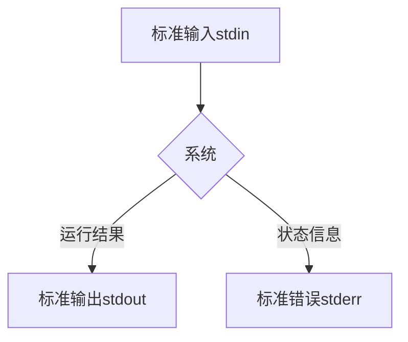

[TOC]

### 标准输入、输出和错误
程序输出的两种类型：
1. 程序运行结果：程序要完成的功能。
2. 状态和错误信息：程序进展。

与 Unix 主题 “任何东西都是一个文件” 保持一致，程序，比方说 `ls`，实际上把他们的运行结果输送到一个叫做**标准输出**的特殊文件（经常用 stdout 表示），而它们的状态信息则送到另一个叫做**标准错误**的文件（stderr）。
默认情况下，标准输出和标准错误都连接到屏幕，而不是保存到磁盘文件。除此之外，许多程序从一个叫做**标准输入**（stdin）的设备得到输入，默认情况下， 标准输入连接到键盘。



### I/O 重定向
"I/O" 代表输入/输出， 通过这个工具，你可以重定向命令的输入输出，命令的输入来自文件，而输出也存到文件。 也可以把多个命令连接起来组成一个强大的命令管道。

I/O 重定向允许我们可以更改输出走向和输入来向。一般地，输出送到屏幕，输入来自键盘， 但是通过 I/O 重定向，我们可以改变输入输出方向。

**I/O重定向** 简单来说就是一个过程，这个过程捕捉一个文件，或者命令、程序、脚本，甚至脚本中的代码块（ code block）的输出，然后把捕捉到的输出，作为输入发送给另外一个文件、命令、程序或者脚本。

### 重定向标准输出：`>`
使用重定向符号`>`，将标准输出重定向到某个文件：
```
ls -l /usr/bin > ls-output.txt
```
* **当使用 ">" 重定向符来重定向输出结果时，目标文件总是从开头被重写。** 也就是说，即使某个命令没有产生标准输出，而是产生了错误信息。原先已经存在的文件内容也会被清空。
* 事实上，如果我们需要删除一个文件内容（或者创建一个新的空文件），可以使用这样的技巧：
```shell
$ > ls-output.txt

# 实测结果
# 事实上，此刻shell会等待用户的键盘输入，必须再次键盘：Ctrl + C 退出输入才行。
```

推荐使用以下命令清空文件：
```
cat /dev/null > test.sh
```

### 重定向标准输出：`>>`
重定向符“>>”的作用是：把重定向结果**追加**到文件内容后面，而不是从开头重写文件。
```
ls -l /usr/bin >> ls-output.txt
```
使用 ">>" 操作符，将导致输出结果追加到文件内容之后。如果文件不存在，文件会被创建，就如使用了'>'操作符。

### 重定向标准错误

**文件描述符** 是一个数字，不同数字代不同的含义，默认情况下，系统占用了3个，分别是0标准输入（stdin）、1标准输出（stdout）、2标准错误（stderr），另外3~9是保留的标识符，以把这些标识符指定成标准输入、输出或者错误作为临时连接。

| 文件描述符 |缩写 | 描述 |
| :---: |--- |--- |
| 0 | STDIN | 标准输入 |
| 1 | STDOUT | 标准输出 |
| 2 | STDERR | 标准错误 |
| 3～9 | | 系统保留标识符 |

重定向标准错误缺乏专用的重定向操作符。重定向标准错误，我们必须参考它的文件描述符。一个程序可以在几个编号的文件流中的任一个上产生输出。然而我们必须把这些文件流的前三个看作标准输入，输出和错误，shell 内部参考它们为文件描述符 0，1 和 2.各自地，shell 提供了一种表示法来重定向文件，使用文件描述符。因为标准错误和文件描述符 2 一样，我们用这种表示法来重定向标准错误：
* 重定向标准错误：
```shell
$ ls -l /bin/usr 2> ls-error.txt
```

* 重定向错误和输出到不同的文件：
```
# 正常输出重定向到 test2
# 错误输出重定向到 test1
$ ls -l file 2> test1 1> test2
```

重定向标准输出和错误到同一个文件（传统方法）：
```shell
# 1. 首先重定向标准输出到文件 ls-output.txt，
# 2. 然后重定向文件描述符 2（标准错误）到文件描述符 1（标准输出）使用表示法 2>&1。
# 注意重定向的顺序安排非常重要。标准错误的重定向必须总是出现在标准输出重定向之后，要不然它不起作用。
$ ls -l /bin/usr > ls-output.txt 2>&1
```

重定向标准输出和错误到同一个文件（精简方法）：
```shell
# 使用表示法 &> 来重定向标准输出和错误到文件 ls-output.txt
$ ls -l /bin/usr &> ls-output.txt
```

### 重定向标准输入：`<`
把一个文件作为标准输入源：
```shell
$ cat < to_do_list.txt
* [ ] 5:00 P.M. - Have dinner with friends.
```

### 内联输入重定向：`<<`


### 管道：`|`

管道线：命令可以从标准输入读取数据，然后再把数据输送到标准输出（将一个命令的输出作为另一个命令的输入）。
```shell
command1 | command 2
```
示例：用 less 来一页一页地显示任何命令的输出：
```shell
$ ls -l /usr/bin | less

# 列出文件和目录，并排序，然后按页显示
$ ls -l | sort | more
```

### 在脚本中重定向输出

可以在脚本中用 STDOUT 和 STDERR 文件描述符以在多个位置生成输出。

#### 临时重定向：`>&n`

在脚本中将单独一行输出重定向到 STDERR。
```
# 在重定向到文件描述符时，必须在文件描述符数字之前加一个&
echo "This is an error message" >&2
```

#### 永久重定向：`exec n>filename`

如果脚本中有大量数据需要重定向，那重定向每个 `echo` 语句就会很烦琐。取而代之，你可以用 `exec` 命令告诉 shell 在脚本执行期间重定向某个特定文件描述符。
```shell
#!/bin/bash

# 错误输出被重定向到 testerror
exec 2>testerror

echo "This is a test of redirecting all output"
echo "from a script to another file"

# 正常输出被重定向到 testout
exec 1>testout

echo "This is a test of redirecting all output"
echo "from a script to another file" >&2
```

### 在脚本中重定向输入：`exec 0< filename`

`exec` 命令允许你将STDIN 重定向到Linux系统上的文件中：
```shell
#!/bin/bash
# 从 testfile 文件中获得输入，逐行打印

exec 0< testfile
count=1

while [ read line ]; do
  echo "Line #$count : $line"
  count=$[ $count + 1]
done
```

### 创建自己的重定向

#### 1.创建输出文件描述符：`exec n>filename`

使用 `exec` 命令给输出分配文件描述符

```shell
#!/bin/bash
# using an alternative file descriptor

exec 3>test

echo "This should display on the monitor"
echo "and this should be stored in the file" >&3
echo "Then this should be back on the monitor"
```
也可以不用创建新文件，而是使用 `exec` 命令来将输出追加到现有文件中：
```shell
exec 3>>testfile
```

#### 2.重定向文件描述符

怎么恢复已重定向的文件描述符？

你可以分配另外一个文件描述符给标准文件描述符，反之亦然。这意味着你可以将 STDOUT 的原来位置重定向到另一个文件描述符，然后再利用该文件描述符重定向回 STDOUT 。

```shell
#!/bin/bash
#storing STDOUT, then coming back to it

# 将文件描述符3重定向到文件描述符1的当前位置，也就是 STDOUT。这意味着任何发送给文件描述符3的输出都将出现在显示器上。
exec 3>&1

# 将STDOUT重定向到文件，shell现在会将发送给STDOUT的输出直接重定向到输出文件中。
# 但是，文件描述符3仍然指向STDOUT原来的位置，也就是显示器。
# 如果此时将输出数据发送给文件描述符3，它仍然会出现在显示器上，尽管STDOUT已经被重定向了。
exec 1>test

echo "This should store in output file"
echo "along with this line"

# 将STDOUT重定向到文件描述符3的当前位置（现在仍然是显示器）。这意味着现在STDOUT又指向了它原来的位置：显示器。
exec 1>&3

echo "Now things should be back to normal"
```

#### 3.创建输入文件描述符

在重定向到文件之前，先将 STDIN 文件描述符保存到另外一个文件描述符，然后在读取完文件之后再将STDIN 恢复到它原来的位置。
```shell
#!/bin/bash
# redirecting input file descriptors

exec 3>&1
echo "This is the 3 file descriptor" >&3

# 文件描述符 6 用来保存 STDIN 的位置
exec 6>&0
exec 0<test

count=1
while read line; do
	echo "Line #$count: $line"
	count=$(($count + 1))
done

# 读取完成后，脚本将 STDIN 重定向到文件描述符 6
exec 0<&6

# 测试 STDIN 是否恢复正常
read -p "Are you done now?" answer
case $answer in
Y | y) echo "Goodbye" ;;
N | n) echo "Sorry, this is the end" ;;
esac
```

#### 4.创建读写文件描述符：`exec n<>filename`

用同一个文件描述符对同一个文件进行读写。

```shell
#!/bin/bash
# testing inpiut/output file descriptor

exec 3<> test
read line <&3
echo "Read: $line"
echo "This is the test line" >&3
```
当脚本向文件中写入数据时，它会从文件指针所处的位置开始。read 命令读取了第一行数据，所以它使得文件指针指向了第二行数据的第一个字符。在 `echo` 语句将数据输出到文件时，它会将数据放在文件指针的当前位置，覆盖了该位置的已有数据。


#### 5. 关闭文件描述符：`&-`
如果你创建了新的输入或输出文件描述符，shell会在脚本退出时自动关闭它们。然而在有些情况下，你需要**在脚本结束前手动关闭文件描述符**。

```shell
#!/bin/bash
# testing closing file descriptors

exec 3>test
echo "This is a test line of data" >&3
# 关闭文件描述符 3
exec 3>&-
echo "This won't work" >&3

cat test
# 关闭后再打开同一个文件，系统会自动覆盖已有文件。
exec 3>test
echo "This'll be bad" >&3
```

### `lsof` 列出打开的文件描述符

`lsof` 命令会列出整个 Linux 系统打开的所有文件描述符。这是个有争议的功能，因为它会向非系统管理员用户提供 Linux 系统的信息。鉴于此，许多 Linux 系统隐藏了该命令，这样用户就不会一不小心就发现了。

在很多 Linux 系统中（如Fedora），`lsof` 命令位于 /usr/sbin 目录。要想以普通用户账户来运行它，必须通过全路径名来引用： 
```
$ /usr/sbin/lsof
```
常见选项：
* -p：指定进程 ID（PID）；
* -d：指定要显示的文件描述符编号；
* $$：显示进程的当前 PID；
* -a：对其他两个选项的结果执行布尔 AND 运算

```shell
$ /usr/sbin/lsof -a -p $$ -d 0,1,2
COMMAND   PID    USER   FD   TYPE DEVICE SIZE/OFF NODE NAME
zsh     14869 huqilin    0u   CHR   16,1   0t1040  689 /dev/ttys001
zsh     14869 huqilin    1u   CHR   16,1   0t1040  689 /dev/ttys001
zsh     14869 huqilin    2u   CHR   16,1   0t1040  689 /dev/ttys001
```

#### `lsof` 的默认输出

列 | 描述
---- | ----
COMMAND | 正在运行的命令名的前9个字符
PID | 进程的PID
USER | 进程属主的登录名
FD | 文件描述符号以及访问类型（r 代表读，w 代表写，u 代表读写）
TYPE | 文件的类型（CHR 代表字符型，BLK 代表块型，DIR 代表目录，REG 代表常规文件）
DEVICE | 设备的设备号（主设备号和从设备号）
IZE | 如果有的话，表示文件的大小
NODE | 本地文件的节点号
NAME | 文件名

### 阻止命令输出：`/dev/null`

有时候 “沉默是金”，我们不想要一个命令的输出结果，只想把它们扔掉。这种情况尤其适用于错误和状态信息。系统为我们提供了解决问题的方法，通过重定向输出结果到一个特殊的叫做 "**/dev/null**" 的文件。这个文件是系统设备，叫做位存储桶，它可以接受输入，并且对输入不做任何处理。为了隐瞒错误信息，我们这样做：

#### 输出重定向
```shell
# 将错误输出重定向到 /dev/null
$ ls -l /bin/usr 2> /dev/null
```

#### 清除日志文件：`cat /dev/null > [Logname]`

在输入重定向中将 /dev/null 作为输入文件，用于快速清除现有文件中的内容。
```shell
# 使用场景：清除日志文件
$ cat /dev/null > /var/log
```

### `cat` 连接文件
`cat` 命令读取一个或多个文件，然后复制它们到标准输出。
格式：`cat file`

* 使用 `cat` 命令显示文件内容而没有分页：
```shell
$ cat ls-output.txt
```

* `cat` 经常被用来显示简短的文本文件。因为 `cat` 可以接受不只一个文件作为参数，所以它也可以用来把文件连接在一起：

```shell
cat movie.mpeg.0* > movie.mpeg
```

* 用 `cat` 实现类似「文字处理器」的示例（创建简短的文本文件）：
```
$ cat > to_do_list.txt
* [ ] 5:00 P.M. - Have dinner with friends.
$ cat to_do_list.txt
* [ ] 5:00 P.M. - Have dinner with friends.
```
说明：
1. 如果 `cat` 没有给出任何输入参数，它会默认从标准输入（键盘）读入数据。
2. 键盘输入内容完毕后，输入 **Ctrl+d**，来告诉 `cat`，在标准输入中， 它已经到达文件末尾（EOF）。

### `sort` 文件过滤分割与合并

`sort` 命令将文件进行排序，并将排序结果标准输出。

管道线经常用来对数据完成复杂的操作。有可能会把几个命令放在一起组成一个管道线。 通常，以这种方式使用的命令被称为**过滤器**。过滤器接受输入，以某种方式改变它，然后输出它。第一个我们想试验的过滤器是 `sort`。想象一下，我们想把目录 /bin 和 /usr/bin 中 的可执行程序都联合在一起，再把它们排序，然后浏览执行结果：
```shell
ls /bin /usr/bin | sort | less
```

### `uniq` 报道或忽略重复行
`uniq` 命令经常和 `sort` 命令结合在一起使用。`uniq` 从标准输入或单个文件名参数接受数据有序列表，默认情况下，从数据列表中删除任何重复行。
```shell
# 删除任何重复的内容
ls /bin /usr/bin | sort | uniq |less

# 不删除重复的内容
ls /bin /usr/bin | sort | uniq -d |less
```

### `wc` 打印行，字和字节数
wc（字计数）命令是用来显示文件所包含的行数，单词数和字节数。
```shell
$ wc to_do_list.txt
 1 10 44 to_do_list.txt
```
"-l" 选项限制命令输出只能报道行数：
```shell
# 查看有序列表中程序个数
$ ls /bin /usr/bin | sort | uniq | wc -l
1024
```

### `grep`、`egrep` 文件内容查找
* `grep` (global regular expression print) 用于找到文件中的匹配文本。
* `grep` 通过“基础正则表达式”进行搜索。
* 格式：`grep [OPTIONS] pattern [file...]`


| 参数 | 意义 |
| --- | --- |
| -i | 忽略大小写 |
| -v | 只打印不匹配的行 |

* 示例一：找到文件名中包含单词“zip”的所有文件
```shell
# 命令说明
# “|” 是管道标识符，将一条命令的输出连接到另一条命令的输入。
# ls /bin /usr/bin —— 打印这两个目录下的所有命令
# sort —— 对上述命令进行排序
# uniq —— 删除重复项
# grep zip —— 匹配包含 zip 的命令

$ ls /bin /usr/bin | sort | uniq | grep zip
bunzip2
bzip2
bzip2recover
gpg-zip
gunzip
gzip
zipdetails
```


* 示例二：查看 /dev 目录下以“sd”开头的文件，即显示所有硬盘文件。
```shell
$ ls /dev/ | grep sd
```

`egrep` 命令是 `grep` 的一个衍生，支持POSIX扩展正则表达式。POSIX扩展正则表达式含有更多的可以用来指定匹配模式的字符。

### `mktemp` 创建临时文件

* Linux 使用 /tmp 目录来存放不需要永久保留的文件。大多数 Linux 发行版配置了系统在启动时自动删除 /tmp 目录的所有文件。
* 系统上的任何用户账户都有权限在读写/tmp目录中的文件。
* `mktemp` 命令可以在 /tmp 目录中创建一个唯一的临时文件。

#### 创建本地临时文件

```shell
#!/bin/bash
# creating and using a temp file

# mktemp 命令的输出就是它所创建的文件的名字
tempfile=$(mktemp test.XXXXXX)

exec 3>$tempfile

echo "This script writes to temp file $tempfile"

echo "This is the first line" >&3
echo "This is the second line" >&3
echo "This is the last line" >&3

# &- 关闭文件描述符
exec 3>&-

echo "Done creating temp file. The contents are:"

cat $tempfile

rm -f $tempfile 2>/dev/null
```

#### `mktmp -t` 在 /tmp 目录创建临时文件

* **-t** 选项会强制 `mktemp` 命令来在系统的临时目录来创建该文件。
* 在用这个特性时，`mktemp` 命令会返回用来创建临时文件的全路径，而不是只有文件名。

```shell
#!/bin/bash
# creating a temp file in /tmp

tempfile=$(mktemp -t tmp.XXXXXX)

echo "This is a test file" >$tempfile
echo "This is the second line of the test" >>$tempfile

echo ”The temp is locate at : $tempfile“
cat $tempfile
rm -f $tempfile
```

#### `mktmp -d` 创建临时目录

**-d** 选项告诉 `mktemp` 命令来创建一个临时目录而不是临时文件。

```shell
#!/bin/bash
# using a temporary directory

tempdir=$(mktemp -d dir.XXXXXX)
cd $tempdir

tempfile1=$(mktemp temp.XXXXXX)
tempfile2=$(mktemp temp.XXXXXX)
exec 7>$tempfile1
exec 8>$tempfile2

echo "Sending data to directory $tempdir"
echo "This is a test line of data for $tempfile1" >&7
echo "This is a test line of data for $tempfile2" >&8
```


### `tee` 同时输出到标准输出和文件

将输出同时发送到显示器和日志文件，这种做法有时候能够派上用场。你不用将输出重定向两次，只要用特殊的`tee` 命令就行。

`tee` 从 Stdin 读取数据，并同时输出到 Stdout 和文件。

`tee` 程序从标准输入读入数据，并且同时复制数据到标准输出（允许数据继续随着管道线流动）和一个或多个文件。(内容既输出到 stdout，又保存到文件。)

`tee` 命令相当于管道的一个T型接头。它将从 STDIN 过来的数据同时发往两处。一处是 STDOUT ，另一处是 `tee` 命令行所指定的文件名：
```shell
tee filename
```

* 默认情况下，`tee` 命令会在每次使用时覆盖输出文件。
* 如果你想将数据追加到文件中，必须用 -a 选项。

```shell
#!/bin/bash
# using the tee command for logging
# 将输入一边发送到 STDOUT，一边发送到日志文件。
tempfile=test
echo "This is the start of the test" | tee $tempfile
echo "This is the second line of the test" | tee -a $tempfile
echo "This is the end line of the test" | tee -a $tempfile
```
