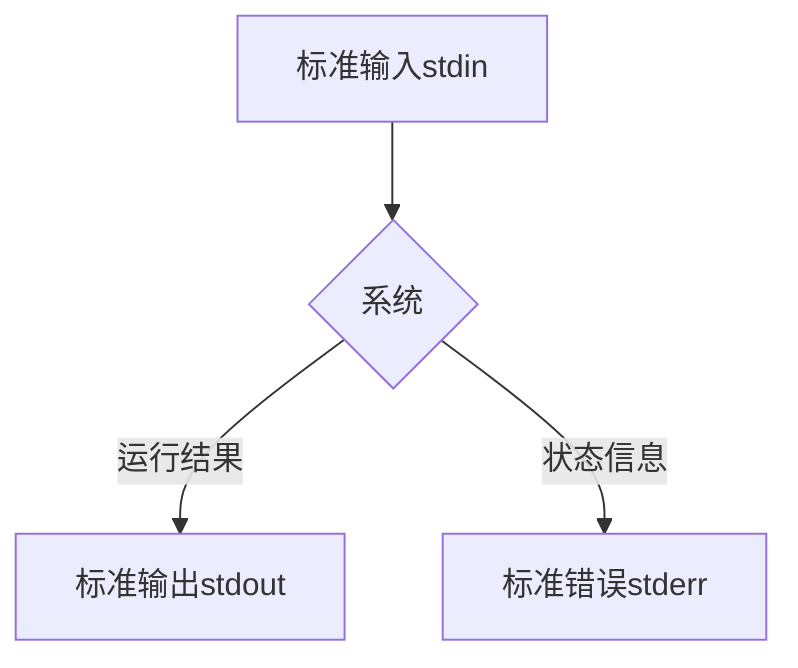

[TOC]

### 标准输入、输出和错误
程序输出的两种类型：
1. 程序运行结果：程序要完成的功能。
2. 状态和错误信息：程序进展。

与 Unix 主题 “任何东西都是一个文件” 保持一致，程序，比方说 `ls`，实际上把他们的运行结果输送到一个叫做标准输出的特殊文件（经常用 stdout 表示），而它们的状态信息则送到另一个叫做标准错误的文件（stderr）。
默认情况下，标准输出和标准错误都连接到屏幕，而不是保存到磁盘文件。除此之外，许多程序从一个叫做标准输入（stdin）的设备得到输入，默认情况下， 标准输入连接到键盘。



### I/O 重定向
"I/O" 代表输入/输出， 通过这个工具，你可以重定向命令的输入输出，命令的输入来自文件，而输出也存到文件。 也可以把多个命令连接起来组成一个强大的命令管道。

I/O 重定向允许我们可以更改输出走向和输入来向。一般地，输出送到屏幕，输入来自键盘， 但是通过 I/O 重定向，我们可以改变输入输出方向。

**I/O重定向** 简单来说就是一个过程，这个过程捕捉一个文件，或者命令、程序、脚本，甚至脚本中的代码块（ code block）的输出，然后把捕捉到的输出，作为输入发送给另外一个文件、命令、程序或者脚本。

### 重定向标准输出：`>`
使用重定向符号`>`，将标准输出重定向到某个文件：
```
ls -l /usr/bin > ls-output.txt
```
* **当使用 ">" 重定向符来重定向输出结果时，目标文件总是从开头被重写。** 也就是说，即使某个命令没有产生标准输出，而是产生了错误信息。原先已经存在的文件内容也会被清空。
* 事实上，如果我们需要删除一个文件内容（或者创建一个新的空文件），可以使用这样的技巧：
```shell
$ > ls-output.txt
```

### 重定向标准输出：`>>`
重定向符“>>”的作用是：把重定向结果追加到文件内容后面，而不是从开头重写文件。
```
ls -l /usr/bin >> ls-output.txt
```
使用 ">>" 操作符，将导致输出结果追加到文件内容之后。如果文件不存在，文件会被创建，就如使用了'>'操作符。

### 重定向标准错误

**文件描述符** 是一个数字，不同数字代不同的含义，默认情况下，系统占用了3个，分别是0标准输入（stdin）、1标准输出（stdout）、2标准错误（stderr），另外3~9是保留的标识符，以把这些标识符指定成标准输入、输出或者错误作为临时连接。

| 文件描述符 | 含义 |
| :---: | --- |
| 0 | 标准输入 |
| 1 | 标准输出 |
| 2 | 标准错误 |
| 3～9 | 系统保留标识符 |

重定向标准错误缺乏专用的重定向操作符。重定向标准错误，我们必须参考它的文件描述符。一个程序可以在几个编号的文件流中的任一个上产生输出。然而我们必须把这些文件流的前三个看作标准输入，输出和错误，shell 内部参考它们为文件描述符 0，1 和 2，各自地。shell 提供了一种表示法来重定向文件，使用文件描述符。因为标准错误和文件描述符 2 一样，我们用这种表示法来重定向标准错误：
* 重定向标准错误：
```shell
$ ls -l /bin/usr 2> ls-error.txt
```

重定向标准输出和错误到同一个文件（传统方法）：
```shell
# 1. 首先重定向标准输出到文件 ls-output.txt，
# 2. 然后重定向文件描述符 2（标准错误）到文件描述符 1（标准输出）使用表示法 2>&1。
# 注意重定向的顺序安排非常重要。标准错误的重定向必须总是出现在标准输出重定向之后，要不然它不起作用。
$ ls -l /bin/usr > ls-output.txt 2>&1
```

重定向标准输出和错误到同一个文件（精简方法）：
```shell
# 使用表示法 &> 来重定向标准输出和错误到文件 ls-output.txt
$ ls -l /bin/usr &> ls-output.txt
```

### 处理不需要的输出
有时候 “沉默是金”，我们不想要一个命令的输出结果，只想把它们扔掉。这种情况尤其适用于错误和状态信息。系统为我们提供了解决问题的方法，通过重定向输出结果到一个特殊的叫做 "**/dev/null**" 的文件。这个文件是系统设备，叫做位存储桶，它可以接受输入，并且对输入不做任何处理。为了隐瞒错误信息，我们这样做：
```shell
# 将错误输出重定向到 /dev/null
$ ls -l /bin/usr 2> /dev/null
```

### `cat` 连接文件
`cat` 命令读取一个或多个文件，然后复制它们到标准输出。
格式：`cat file`

* 使用 `cat` 命令显示文件内容而没有分页：
```shell
$ cat ls-output.txt
```

* `cat` 经常被用来显示简短的文本文件。因为 `cat` 可以接受不只一个文件作为参数，所以它也可以用来把文件连接在一起：

```shell
cat movie.mpeg.0* > movie.mpeg
```

* 用 `cat` 实现类似「文字处理器」的示例（创建简短的文本文件）：
```
$ cat > to_do_list.txt
* [ ] 5:00 P.M. - Have dinner with friends.
$ cat to_do_list.txt
* [ ] 5:00 P.M. - Have dinner with friends.
```
说明：
1. 如果 `cat` 没有给出任何输入参数，它会默认从标准输入（键盘）读入数据。
2. 键盘输入内容完毕后，输入 **Ctrl+d**，来告诉 `cat`，在标准输入中， 它已经到达文件末尾（EOF）。

#### 重定向标准输入：`<`
把一个文件作为标准输入源：
```shell
$ cat < to_do_list.txt
* [ ] 5:00 P.M. - Have dinner with friends.
```

### 管道线：`|`
管道线：命令可以从标准输入读取数据，然后再把数据输送到标准输出。
```shell
command1 | command 2
```
示例：用 less 来一页一页地显示任何命令的输出：
```
$ ls -l /usr/bin | less
```

### `sort` 文件过滤分割与合并

`sort` 命令将文件进行排序，并将排序结果标准输出。

管道线经常用来对数据完成复杂的操作。有可能会把几个命令放在一起组成一个管道线。 通常，以这种方式使用的命令被称为**过滤器**。过滤器接受输入，以某种方式改变它，然后输出它。第一个我们想试验的过滤器是 `sort`。想象一下，我们想把目录 /bin 和 /usr/bin 中 的可执行程序都联合在一起，再把它们排序，然后浏览执行结果：
```shell
ls /bin /usr/bin | sort | less
```

### `uniq` 报道或忽略重复行
`uniq` 命令经常和 `sort` 命令结合在一起使用。`uniq` 从标准输入或单个文件名参数接受数据有序列表，默认情况下，从数据列表中删除任何重复行。
```shell
# 删除任何重复的内容
ls /bin /usr/bin | sort | uniq |less

# 不删除重复的内容
ls /bin /usr/bin | sort | uniq -d |less
```

### `wc` 打印行，字和字节数
wc（字计数）命令是用来显示文件所包含的行数，单词数和字节数。
```shell
$ wc to_do_list.txt
 1 10 44 to_do_list.txt
```
"-l" 选项限制命令输出只能报道行数：
```shell
# 查看有序列表中程序个数
$ ls /bin /usr/bin | sort | uniq | wc -l
1024
```

### `grep`、`egrep` 文件内容查找
* `grep` (global regular expression print) 用于找到文件中的匹配文本。
* `grep` 通过“基础正则表达式”进行搜索。
* 格式：`grep [OPTIONS] pattern [file...]`


| 参数 | 意义 |
| --- | --- |
| -i | 忽略大小写 |
| -v | 只打印不匹配的行 |

* 示例一：找到文件名中包含单词“zip”的所有文件
```shell
# 命令说明
# “|” 是管道标识符，将一条命令的输出连接到另一条命令的输入。
# ls /bin /usr/bin —— 打印这两个目录下的所有命令
# sort —— 对上述命令进行排序
# uniq —— 删除重复项
# grep zip —— 匹配包含 zip 的命令

$ ls /bin /usr/bin | sort | uniq | grep zip
bunzip2
bzip2
bzip2recover
gpg-zip
gunzip
gzip
zipdetails
```

* 示例二：查看 /dev 目录下以“sd”开头的文件，即显示所有硬盘文件。
```shell
$ ls /dev/ | grep sd
```

### `head` 打印文件的开头部分
`head` 命令打印文件的前十行，而 `tail` 命令打印文件的后十行。默认情况下，两个命令都打印 10 行文本，但是可以通过 "-n" 选项来调整命令打印的行数。


```shell
$ head -n 5 test.js
'use strict';

const dirExists = require('./utils/dirExists');
const path = require('path');
const fs = require('fs');

$ head -5 test.js
'use strict';

const dirExists = require('./utils/dirExists');
const path = require('path');
const fs = require('fs');
```

### `tail` 打印文件的结尾部分

```shell
$ tail -n 5 test.js
        console.log('写入成功');
    });
};

fn();
```

* "-f" 动态显示文件信息，如显示实时日志信息。
```shell
tail -f /var/log/messages
```
ctrl+c，终止当前任务。

### `tee` 从 Stdin 读取数据，并同时输出到 Stdout 和文件
`tee` 程序从标准输入读入数据，并且同时复制数据到标准输出（允许数据继续随着管道线流动）和一个或多个文件。(内容既输出到 stdout，又保存到文件。)

```shell
$ ls /usr/bin | tee ls.txt | grep zip
gpg-zip
zipdetails
```


