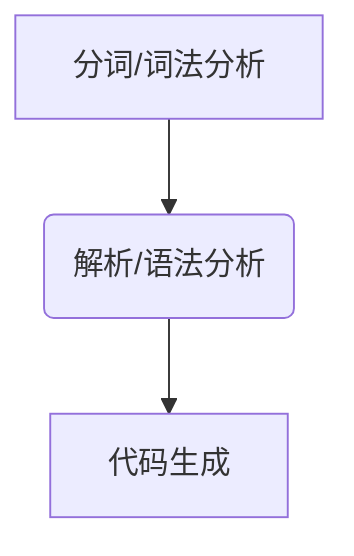

# 作用域

作用域是一套存储、访问变量的规则。这套规则用来管理引擎如何在当前作用域以及嵌套的子作用域中根据标识符名称进行变量查找。如果查找的目的是**对变量进行赋值**，那么就会使用 **LHS 查询**；如果目的是**获取变量的值**，就会使用 **RHS 查询**。

当**变量**出现在**赋值操作**的**左侧**时进行 **LHS 查询**，出现在**右侧**时进行 **RHS 查询**。

赋值操作符会导致 LHS 查询。`=`操作符或调用函数时传入参数的操作都会导致关联作用域的赋值操作（即 LHS 查询）。


## 编译原理

传统编程语言的编译过程：



1. **分词/词法分析**：将由字符组成的字符串分解成（对编程语言来说）有意义的代码块，这些代码块被称为词法单元(token)。
2. **解析/语法分析**：将词法单元流(数组)转换成一个由元素逐级嵌套所组成的代表了程序语法结构的树。这个树被称为“抽象语法树”（Abstract Syntax Tree，AST）。
3. **代码生成**：将 AST 转换为可执行代码。

JavaScript 引擎的特点：

1. JavaScript 不是提前编译的，编译结果也不能在分布式系统中进行移植。 
2. 在语法分析和代码生成阶段有特定的步骤来对运行性能进行优化，包括对冗余元素进行优化等。
3. JavaScript 引擎不会有大量的（像其他语言编译器那么多的）时间用来进行优化，因为与其他语言不同，JavaScript 的编译过程**不是**发生在构建之前的。大部分情况下编译发生在代码执行前的几微秒（甚至更短!）的时间内。 

简单地说，**任何 JavaScript 代码在执行前都要进行编译**。


## 理解作用域

**引擎**：从头到尾负责整个 JavaScript 程序的编译及执行过程。
**编译器**：负责语法分析及代码生成等。
**作用域**：负责收集并维护由所有声明的标识符（变量）组成的一系列查询，并实施一套非常严格的规则，确定当前执行的代码对这些标识符的访问权限。

```JavaScript
/* 变量的赋值操作：
 * 编译器首先会在当前作用域中声明一个变量（如果之前没有声明过）；
 * 在运行时，引擎会在作用域中查找该变量，如果能够找到就会对它赋值。
 */
var a = 2;
```
编译器首先会将这段程序**分解成词法单元**，然后**将词法单元解析成一个树结构**。接下来，编译器执行**代码生成**流程：
1. `var a` 声明变量：「编译器」会询问「作用域」是否已经有一个该名称的变量存在于同一个作用域的集合中。如果是，编译器会忽略该声明，继续进行编译；否则它会要求作用域在当前作用域的集合中声明一个新的变量，并命名为 `a`。
2. `a = 2` 赋值：「编译器」会为「引擎」生成运行时所需的代码。「引擎」运行时会首先询问「作用域」，在当前的作用域集合中是否存在一个叫作 `a` 的变量。如果是，引擎就会使用这个变量；如果否，引擎会继续查找该变量。

### 编译器查询原理：LHS 和 RHS 查询

当**变量**出现在**赋值操作**的**左侧**时进行 **LHS 查询**，出现在**右侧**时进行 **RHS 查询**。

LHS 查询：找到变量的容器本身，从而可以对其**赋值**。
RHS 查询：查询某个变量的值；

```JavaScript
// 对 a 的引用是一个 RHS 引用
// 因为这里 a 并没有赋予任何值。相应地，需要查找并取得 a 的值，这样才能将值传递给 console.log(..)。
console.log(a);

// 对 a 的引用则是 LHS 引用
// 因为实际上我们并不关心当前的值是什么，只是想要为 = 2 这个赋值操作找到一个目标。
a = 2;
```

既有 RHS 引用，又有 LHS 引用的情况：
```JavaScript
function foo(a) {
  console.log('object :', a)
}

/* 
 * 首先，foo(...) 函数调用需要对 foo 进行 RHS 引用，即找到 foo 的值。
 * 隐式的 a=2 操作：首先对 a 进行 LHS 查询，再对 a 进行 RHS 引用对 a 进行赋值。
 */
foo(2)
```

## 作用域嵌套

当一个块或函数嵌套在另一个块或函数中时，就发生了**作用域的嵌套**。
因此，在当前作用域中无法找到某个变量时，引擎就会在外层嵌套的作用域中继续查找，直到找到该变量，或抵达最外层的作用域（也就是全局作用域）为止。

### 把作用域链比喻成一个建筑


这个建筑代表程序中的嵌套作用域链。第一层楼代表当前的执行作用域，也就是你所处的位置。建筑的顶层代表全局作用域。

LHS 和 RHS 引用都会在当前楼层进行查找，如果没有找到，就会坐电梯前往上一层楼，如果还是没有找到就继续向上，以此类推。一旦抵达顶层(全局作用域)，可能找到了你所需的变量，也可能没找到，但无论如何查找过程都将停止。

### 异常

在变量还没有声明（在任何作用域中都无法找到该变量）的情况下，LHS 和 RHS 查询的行为是不一样的。

非严格模式下：
* 如果 RHS 查询在所有嵌套的作用域中遍寻不到所需的变量，引擎就会抛出 `ReferenceError` 异常。
* 当引擎执行 LHS 查询时，如果在顶层（全局作用域）中也无法找到目标变量，全局作用域中就会创建一个具有该名称的变量，并将其返还给引擎，前提是程序运行在非“严格模式”下。

严格模式下：
* **严格模式禁止自动或隐式地创建全局变量**。因此，在严格模式中 LHS 查询失败时，并不会创建并返回一个全局变量，引擎会抛出同 RHS 查询失败时类似的 `ReferenceError` 异常。
* 如果 RHS 查询找到了一个变量，但是你尝试对这个变量的值进行不合理的操作，那么引擎会抛出另外一种类型的异常，叫作 `TypeError`。
* `ReferenceError` 同作用域判别失败相关，而 `TypeError` 则代表作用域判别成功了，但是对结果的操作是非法或不合理的。


# 词法作用域

作用域的两种工作模型：
1. 词法作用域；
2. 动态作用域。

JavaScript 中的作用域就是**词法作用域**。

## 1.词法阶段

**词法作用域**就是定义在**词法阶段**的作用域。**词法作用域**意味着作用域是由书写代码时函数声明的位置来决定的。编译的词法分析阶段基本能够知道全部标识符在哪里以及是如何声明的，从而能够预测在执行过程中如何对它们进行查找。

该示例中有三个逐级嵌套的作用域。为了帮助理解，可以将它们想象成几个逐级包含的气泡：


1. 包含着整个全局作用域，其中只有一个标识符：foo。
2. 包含着 foo 所创建的作用域，其中有三个标识符：a、bar 和 b。
3. 包含着 bar 所创建的作用域，其中只有一个标识符：c。


## 2.查找

作用域气泡的结构和互相之间的位置关系给引擎提供了足够的位置信息，引擎用这些信息来查找标识符的位置。

* 作用域查找始终从运行时所处的最内部作用域开始，**逐级向外或者说向上进行查找**，直到遇见第一个匹配的标识符为止。
* 作用域查找会在找到第一个匹配的标识符时停止。在多层的嵌套作用域中可以定义同名的标识符，这叫作“**遮蔽效应**”（内部的标识符“遮蔽”了外部的标识符）。
* 词法作用域查找只会查找**一级标识符**。


## 欺骗词法

⚠️ 欺骗词法作用域会导致性能下降，因为引擎无法在编译时对作用域查找进行优化，故**不推荐使用**。

### ~~`eval()`~~ 不推荐使用

~~JavaScript 中的 `eval(...)` 函数可以接受一个字符串为参数，并将其中的内容视为好像在书写时就存在于程序中这个位置的代码。换句话说，可以在你写的代码中用程序生成代码并运行，就好像代码是写在那个位置的一样。~~

JavaScript 中的 `eval(...)` 函数可以对一段包含一个或多个声明的“代码”字符串进行演算，并借此来修改已经存在的词法作用域(在运行时)。

默认情况下，如果 `eval(..)` 中所执行的代码包含有一个或多个声明(无论是变量还是函数)，就会对 `eval(..)` 所处的词法作用域进行修改。


```JavaScript
function foo(str, a) {
    // 这段代码实际上在 foo(..) 内部创建了一个变量 b，并遮蔽了外部(全局)作用域中的同名变量。
	eval( str ); // 欺骗!
	console.log( a, b );
}

var b = 2;

foo( "var b = 3;", 1 ); // 1 3
```

在程序中动态生成代码的使用场景非常罕见，因为它所带来的好处无法抵消性能上的损失。

### ~~`with`~~ 不推荐使用

`with` 通常被当作重复引用同一个对象中的多个属性的快捷方式，可以不需要重复引用对象本身。


`with` 可以将一个没有或有多个属性的对象处理为一个完全隔离的词法作用域，因此这个对象的属性也会被处理为定义在这个作用域中的词法标识符。

`with` 本质上是通过将一个对象的引用当作作用域来处理，将对象的属性当作作用域中的标识符来处理，从而创建了一个新的词法作用域（同样是在运行时）。

```JavaScript
function foo(obj) {
	with (obj) {
		a = 2;
	}
}

var o1 = {
	a: 3
};

var o2 = {
	b: 3
};

foo( o1 );
console.log( o1.a ); // 2

foo( o2 );
console.log( o2.a ); // undefined
// o2 的作用域、foo(..) 的作用域和全局作用域中都没有找到标识符 a，因此当 a=2 执行 时，自动创建了一个全局变量(因为是非严格模式)。
console.log( a ); // 2 -- Oops, leaked global!
```

# 函数作用域和块作用域

函数是 JavaScript 中最常见的作用域单元，除此之外，JavaScript 中也有几个叫做「块作用域」的特性（如`let`、`const`）。

## 函数中的作用域

函数作用域：属于这个函数的全部变量都可以在整个函数的范围内使用及复用（事实上在嵌套的作用域中也可以使用）。


## 隐藏内部实现

由「函数作用域」这一规则所引发的启示：可以把变量和函数包裹在一个函数的作用域中，然后用这个作用域来“隐藏”它们。

**最小特权原则/最小授权或最小暴露原则**：在软件设计中，应该最小限度地暴露必要内容，而将其他内容都“隐藏”起来，比如某个模块或对象的 API 设计。


## 规避冲突

“隐藏”作用域中的变量和函数可以**避免同名标识符之间的冲突**，两个标识符可能具有相同的名字但用途却不一样，无意间可能造成命名冲突。冲突会导致变量的值被意外覆盖。

1. 全局命名空间；
2. 模块机制：通过依赖管理器的机制将库的标识符显式地导入到另外一个特定的作用域中。

## 函数作用域

在任意代码片段外部添加包装函数，可以将内部的变量和函数定义“隐藏”起来，外部作用域无法访问包装函数内部的任何内容。

```JavaScript
var a = 2;

// 函数表达式语法
// (function foo(){ .. })作为函数表达式意味着foo只能在..所代表的位置中被访问，外部作用域则不行。
// foo 被绑定在函数表达式自身的函数中
// foo 变量名被隐藏在自身中意味着不会非必要地污染外部作用域
(function foo () {
  var a = 3;
  console.log(a); // 3
})();

console.log(a); // 2
```

### 匿名和具名

**匿名函数表达式**：

```JavaScript
// function().. 没有名称标识符
setTimeout( function(){
    console.log("I waited 1 second!");
}, 1000 );
```

函数表达式可以匿名，而函数声明则不可以省略函数名。
匿名函数的缺点：
1. 调试困难，匿名函数在栈追踪中不会显示出有意义的函数名。
2. 无法引用自身，如果没有函数名，当函数需要引用自身时只能使用已经过期的 `arguments.callee` 引用。
3. 匿名函数没有函数名，降低了代码的可读性/可理解性。一个描述性的名称可以让代码不言自明。

**行内函数表达式**：

```JavaScript
setTimeout( function timeoutHandler(){ // <-- Look, I have a name!
    console.log( "I waited 1 second!" );
}, 1000 );
```
通过「行内函数表达式」的方式可以给函数表达式指定一个函数名，可以有效解决匿名函数的缺点。

💡始终给函数表达式命名是一个最佳实践。

### 立即执行函数表达式（IIFE）

```JavaScript
var a = 2;

// (function foo(){ .. })()
// 第一个 ( ) 将函数变成了一个函数表达式，
// 第二个 ( ) 表示立即执行该函数。
(function foo () {
  var a = 3;
  console.log(a); // 3
})();

console.log(a); // 2
```

相较于传统的 IIFE（Immediately Invoked Function Expression，立即执行函数表达式） 形式，很多人都更喜欢另一个改进的形式：`(function(){ .. }())`。两者功能一致。

IIFE 的常见用法：
1. 配合匿名函数表达式使用。
2. 把匿名函数表达式当作函数调用并传递参数。

```JavaScript
var a = 2;

// 将 window 对象的引用传递进去，但将参数命名为 global
(function IIFE (global) {
  var a = 3;
  console.log(a); // 3
  console.log(global.a); // 2
})(window);

console.log(a); // 2
```

IIFE 的常见用法：3.解决 `undefined` 标识符的默认值被错误覆盖导致的异常（不常见）。
IIFE 的常见用法：4.倒置代码的运行顺序，UMD 项目中被广泛使用。

## 块作用域

块作用域：变量和函数不仅可以属于所处的作用域，也可以属于某个代码块（通常指 { .. } 内部）。

块作用域的用处：变量的声明应该距离使用的地方越近越好，并最大限度地本地化。

### `with`

用 `with` 从对象中创建出的作用域仅在 `with` 声明中而非外部作用域中有效。

### `try/catch`

JavaScript 的 ES3 规范中规定 **`try/catch` 的 `catch` 分句会创建一个块作用域**，其中声明的变量仅在 `catch` 内部有效。

```JavaScript
try {
  undefined(); // 执行一个非法操作来强制制造一个异常
}
catch (err) {
  console.log(err); // 能够正常执行!
}

console.log(err); // ReferenceError: `err` not found
```

### `let`

`let` 关键字可以自动将变量绑定到所在的任意作用域中。

```JavaScript
var foo = true;

if (foo) {
  let bar = foo * 2;
  bar = something(bar);
  // 可以访问 bar 变量
  console.log(bar);
}

// {...} 外部无法访问 bar 变量
console.log(bar); // ReferenceError 引用错误
```

使用 `let` 进行的声明不会在块作用域中进行提升：
```JavaScript
{
   console.log( bar ); // ReferenceError!
   let bar = 2;
}
```


### `const`

ES6 引入了 `const`，用来创建**块作用域变量**，但其值是固定的 (常量)。之后任何试图修改值的操作都会引起错误。

# 提升

* 变量/函数声明提升：所有的声明（变量和函数）都会被“移动”到各自作用域的最顶端。只有声明本身会被提升，而赋值或其他运行逻辑会留在原地。
* 函数会首先被提升，然后才是变量。
* 函数声明会被提升，但是函数表达式却不会被提升。
* 使用 `let`、`const` 进行声明的变量不会在块作用域中进行提升。

# 作用域闭包

当函数可以记住并访问所在的词法作用域，即使函数是在当前词法作用域之外执行，这时就产生了**闭包**。

```JavaScript
function foo () {
  var a = 2;

  // 函数 bar() 的词法作用域能够访问 foo() 的内部作用域。
  function bar () {
    console.log(a);
  }
    
  // 将 bar 所引用的函数对象本身当作返回值（把一个内部函数当作值返回）
  return bar;
}

// 闭包：bar() 依然持有对它的作用域的引用。
// foo() 函数执行之后，foo() 的整个内部作用域并没有被销毁，因为 bar() 函数仍然引用着 foo() 的内部作用域
var baz = foo();

// bar() 在自己定义的词法作用域以外的地方执行了
// 闭包使得 bar() 函数仍然可以继续访问它被定义时的词法作用域
baz(); // 2 -- 朋友，这就是闭包的效果。
```

## 循环和闭包

使用 `var` 关键字：
```JavaScript
// 尽管循环中的五个函数是在各个迭代中分别定义的，但是它们都被封闭在一个共享的全局作用域中，因此实际上只有一个 i。
// for 循环外面也可以访问变量 i
for (var i = 1; i <= 5; i++) {
  // 延迟函数的回调会在循环结束时才执行，而函数终止的条件是当 i = 6 时。
  setTimeout(() => {
    console.log(i);
  }, i * 1000);
}

/*
6
6
6
6
6
*/
```

使用 `let` 关键字：
```JavaScript
// 变量在循环过程中不止被声明一次，每次迭代都会声明。
// 每个迭代都会使用上一个迭代结束时的值来初始化这个变量。
for (let index = 0; index <= 5; index++) {
  setTimeout(() => {
    console.log(index)
  }, index);
}

/*
0
1
2
3
4
5
*/
```

## 模块

模块的底层原理就是**闭包**。


模块的两个主要特征:
1. 为创建内部作用域而调用了一个包装函数;
2. 包装函数的返回值必须至少包括一个对内部函数的引用，这样就会创建涵盖整个包装函数内部作用域的闭包。

模块也是普通的函数，因此可以接受参数。

模块模式另一个简单但强大的变化用法是，命名将要作为公共 API 返回的对象:

### 未来的模块机制

ES6 中为模块增加了一级语法支持。但通过模块系统进行加载时，ES6 会将文件当作独立的模块来处理。每个模块都可以导入其他模块或特定的 API 成员，同样也可以导出自己的 API 成员。

ES6 的模块必须被定义在一个独立的文件中（即一个文件一个模块）。

`import` 可以将一个模块中的一个或多个 API 导入到当前作用域中，并分别绑定在一个变量上。
`module` 会将整个模块的 API 导入并绑定到一个变量上。
`export` 会将当前模块的一个标识符（变量、函数）导出为公共 API。
这些操作可以在模块定义中根据需要使用任意多次。

**bar.js**
```js
function hello(who) {
	return "Let me introduce: " + who;
}

export hello;
```

**foo.js**
```js
// 仅从 "bar" 模块导入 hello()
import hello from "bar";

var hungry = "hippo";

function awesome() {
	console.log(
		hello( hungry ).toUpperCase()
	);
}

export awesome;
```

**baz.js**
```js
// 导入完整的 "foo" 和 "bar" 模块
module foo from "foo";
module bar from "bar";

console.log(
	bar.hello( "rhino" )
); // Let me introduce: rhino

foo.awesome(); // LET ME INTRODUCE: HIPPO
```
